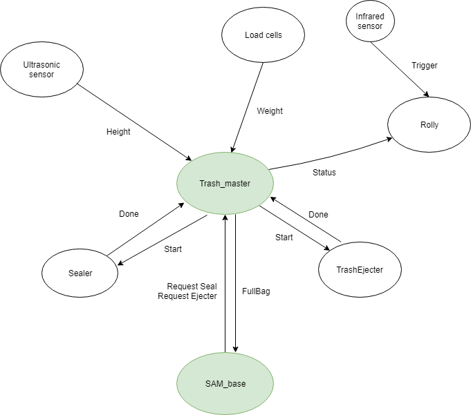

# Trash Nodes
This program controls a module for trash handling. The module can seal and cut new bags, show a friendly face on a screen and throw away a full bag.
This project was executed for RCS.

## How to run

put the nodes on the raspberry pi, and run: 

`roslaunch trashmaster rolly.launch`

run the rolly node on whatever is connected and has a screen (used a tablet with vnc for testing)

`rosrun rolly main.py`

send request to the robot with rosservice:

`rosservice call /requestEject`

`rosservice call /requestSeal`

## Dependencies

ros

RPi.GPIO

pygame for rolly

hx711 library for loadcells (not used in our prototype)

## Pinout

